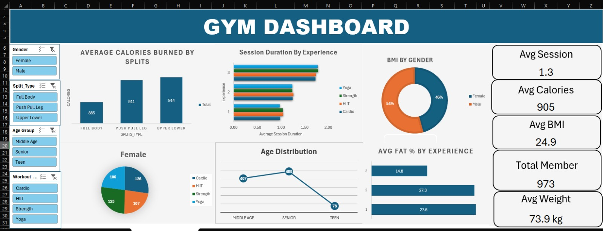

# Gym Members Exercise Dashboard (Excel)

Interactive Excel dashboard analyzing gym member exercise data 
(Kaggle "Gym Members Exercise Dataset").

## Preview

## Key Insights
- Analyzed 973 gym members across split types, workout types, and age groups
- Avg calories burned: 905 | Avg session duration tracked by experience level
- BMI breakdown by gender (54% Female, 46% Male)
- Fat % and session trends across experience levels

## Tools
Excel (PivotTables, PivotCharts, Slicers, Formulas)

## Dataset
Kaggle - Gym Members Exercise Dataset
